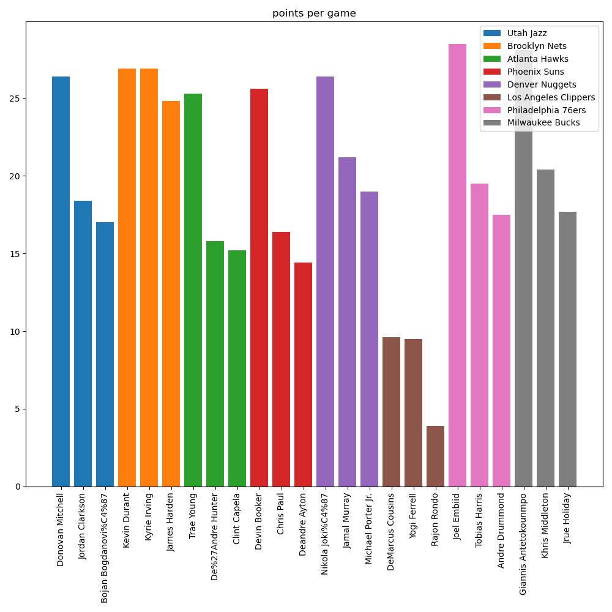

# Simple wikipedia scraper

## Made for the course IN3110

<table><tr>
<td> 
  <p align="center" style="padding: 10px">
    
    <br>
    <em style="color: grey">Blocks per game</em>
  </p> 
</td>
<td> 
  <p align="center">
    
    <br>
    <em style="color: grey">Points per game</em>
  </p> 
</td>
<td> 
  <p align="center">
    
    <br>
    <em style="color: grey">Rebounds per game</em>
  </p> 
</td>
</tr></table>

## Depencies

The dependencies are numpy, matplotlib, beautifulsoup4 and requests.
They can be installed using requirements.txt by typing the following in 
the terminal:

```bash
$ pip install -r requirements.txt
```

## Usage

To generate the results type 

```bash
$ chmod u+x generate_output.sh
$ ./generate_output.sh
````
while in the Assignment5 directory. (Can take a minute)

The following directories with example output should be generated:

- requesting_urls
    - main_page.txt
    - star_wars.txt
    - studio_ghibli.txt
- find_urls
    - bundesliga_articles.txt
    - bundesliga_urls.txt
    - nobel_articles.txt
    - nobel_urls.txt
    - ski_wc_articles.txt
    - ski_wc_urls.txt
- collect_dates_regex
    - feynman_dates.txt
    - rosling_dates.txt
    - rowling_dates.txt
- datetime_filter
    - betting_slip_empty.txt
- NBA_player_statistics
    - players_over_ppg
    - players_over_bpg
    - players_over_rpg

## Comments

I have a weird utf-8 bug that causes some special characters to be replaced with what seems to be nonsense. 
